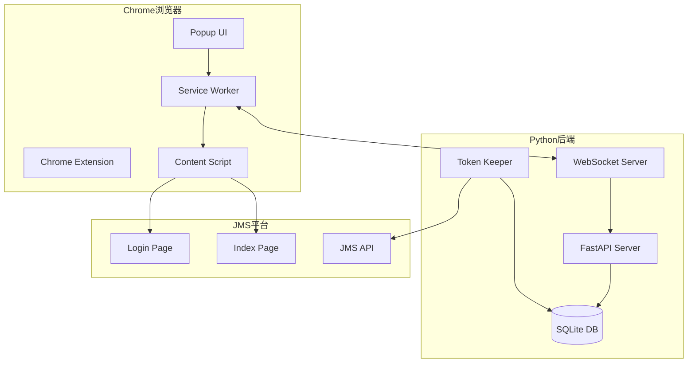
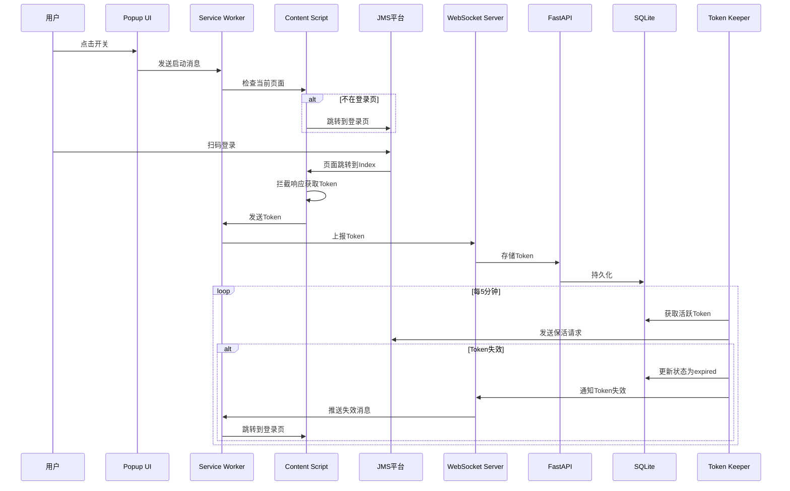

# Design Document: Token Management System

## Overview

Token管理系统采用客户端-服务端架构，由Chrome浏览器插件（客户端）和Python后端服务（服务端）组成。系统通过WebSocket实现双向实时通信，支持Token的自动获取、集中管理、状态监控和失效处理。

### 核心设计目标

1. **自动化**: 最小化用户操作，自动完成Token获取和刷新流程
2. **实时性**: 通过WebSocket实现毫秒级的状态同步和通知推送
3. **可靠性**: 支持断线重连、数据持久化、错误恢复
4. **安全性**: Token加密存储、访问控制、日志脱敏

### 技术栈选择

| 组件 | 技术选型 | 理由 |
|------|----------|------|
| Chrome插件 | Manifest V3 | Chrome官方要求，2024年后V2将被淘汰 |
| 后端框架 | FastAPI | 异步支持好，与现有项目技术栈一致 |
| WebSocket | FastAPI WebSocket | 原生支持，无需额外依赖 |
| 数据库 | SQLite | 轻量级，无需额外部署，适合本地场景 |
| 前端UI | 原生HTML/CSS/JS | 简单场景无需框架，减少复杂度 |

## Architecture

### 系统架构图



### 数据流图



## Components and Interfaces

### 1. Chrome Extension 组件

#### 1.1 Manifest配置 (manifest.json)

```json
{
  "manifest_version": 3,
  "name": "JMS Token Manager",
  "version": "1.0.0",
  "description": "JMS平台Token自动获取与管理",
  "permissions": [
    "storage",
    "tabs",
    "webRequest"
  ],
  "host_permissions": [
    "https://jms.jtexpress.com.cn/*",
    "https://jmsgw.jtexpress.com.cn/*",
    "http://localhost:8080/*"
  ],
  "background": {
    "service_worker": "background.js"
  },
  "content_scripts": [
    {
      "matches": ["https://jms.jtexpress.com.cn/*"],
      "js": ["content.js"]
    }
  ],
  "action": {
    "default_popup": "popup.html",
    "default_icon": {
      "16": "icons/icon16.png",
      "48": "icons/icon48.png",
      "128": "icons/icon128.png"
    }
  }
}
```

#### 1.2 Service Worker (background.js)

```typescript
interface ExtensionState {
  isEnabled: boolean;           // 开关状态
  hasToken: boolean;            // 是否有Token
  wsConnected: boolean;         // WebSocket连接状态
  lastTokenTime: number | null; // 最后Token获取时间
}

interface WebSocketMessage {
  type: 'register' | 'token_upload' | 'heartbeat' | 'token_expired';
  payload: any;
  timestamp: number;
}

// Service Worker 核心接口
class BackgroundService {
  // 初始化WebSocket连接
  connect(serverUrl: string): Promise<void>;
  
  // 断开连接
  disconnect(): void;
  
  // 发送消息到服务器
  sendMessage(message: WebSocketMessage): void;
  
  // 处理来自Content Script的消息
  handleContentMessage(message: any, sender: chrome.runtime.MessageSender): void;
  
  // 处理来自服务器的消息
  handleServerMessage(message: WebSocketMessage): void;
  
  // 获取当前状态
  getState(): ExtensionState;
  
  // 更新状态
  setState(state: Partial<ExtensionState>): void;
}
```

#### 1.3 Content Script (content.js)

```typescript
interface TokenInfo {
  token: string;
  userId: string;
  captureTime: number;
  source: 'response' | 'cookie' | 'localStorage';
}

// Content Script 核心接口
class ContentScript {
  // 监听页面导航
  observeNavigation(): void;
  
  // 拦截网络响应获取Token
  interceptResponse(): void;
  
  // 从Cookie中提取Token
  extractTokenFromCookie(): string | null;
  
  // 从localStorage中提取Token
  extractTokenFromStorage(): string | null;
  
  // 发送Token到Service Worker
  sendTokenToBackground(tokenInfo: TokenInfo): void;
  
  // 跳转到登录页
  navigateToLogin(): void;
  
  // 检查当前页面类型
  getCurrentPageType(): 'login' | 'index' | 'other';
}
```

#### 1.4 Popup UI (popup.html/popup.js)

```typescript
interface PopupState {
  switchEnabled: boolean;
  connectionStatus: 'connected' | 'disconnected' | 'connecting';
  tokenStatus: 'active' | 'expired' | 'none';
  lastUpdate: string;
}

// Popup 核心接口
class PopupController {
  // 初始化UI
  init(): void;
  
  // 切换开关状态
  toggleSwitch(): void;
  
  // 更新UI显示
  updateUI(state: PopupState): void;
  
  // 从Background获取状态
  fetchState(): Promise<PopupState>;
  
  // 发送命令到Background
  sendCommand(command: string, params?: any): void;
}
```

### 2. Python后端组件

#### 2.1 FastAPI主服务 (token_server.py)

```python
from fastapi import FastAPI, WebSocket, HTTPException
from pydantic import BaseModel
from typing import Optional
from datetime import datetime

class TokenCreate(BaseModel):
    """Token创建请求模型"""
    token: str
    user_id: str
    extension_id: str

class TokenResponse(BaseModel):
    """Token响应模型"""
    id: int
    user_id: str
    token_masked: str  # 脱敏后的Token
    status: str
    created_at: datetime
    updated_at: datetime
    last_active_at: Optional[datetime]

class TokenService:
    """Token服务接口"""
    
    async def create_or_update(self, data: TokenCreate) -> TokenResponse:
        """创建或更新Token"""
        pass
    
    async def get_all(self) -> list[TokenResponse]:
        """获取所有Token"""
        pass
    
    async def get_by_user(self, user_id: str) -> Optional[TokenResponse]:
        """根据用户ID获取Token"""
        pass
    
    async def update_status(self, token_id: int, status: str) -> bool:
        """更新Token状态"""
        pass
    
    async def delete(self, token_id: int) -> bool:
        """删除Token"""
        pass
    
    async def update_last_active(self, token_id: int) -> bool:
        """更新最后活跃时间"""
        pass
```

#### 2.2 WebSocket管理器 (websocket_manager.py)

```python
from fastapi import WebSocket
from typing import Dict, Optional
import asyncio

class ConnectionInfo:
    """连接信息"""
    websocket: WebSocket
    extension_id: str
    user_id: Optional[str]
    connected_at: datetime
    last_heartbeat: datetime

class WebSocketManager:
    """WebSocket连接管理器"""
    
    def __init__(self):
        self.connections: Dict[str, ConnectionInfo] = {}
    
    async def connect(self, websocket: WebSocket, extension_id: str) -> None:
        """接受新连接"""
        pass
    
    async def disconnect(self, extension_id: str) -> None:
        """断开连接"""
        pass
    
    async def send_to_extension(self, extension_id: str, message: dict) -> bool:
        """向指定插件发送消息"""
        pass
    
    async def broadcast(self, message: dict) -> None:
        """广播消息给所有连接"""
        pass
    
    async def handle_message(self, extension_id: str, message: dict) -> None:
        """处理来自插件的消息"""
        pass
    
    def get_connection(self, extension_id: str) -> Optional[ConnectionInfo]:
        """获取连接信息"""
        pass
    
    def get_all_connections(self) -> list[ConnectionInfo]:
        """获取所有连接"""
        pass
```

#### 2.3 Token保活服务 (token_keeper.py)

```python
import asyncio
import httpx
from typing import List

class TokenKeeper:
    """Token保活服务"""
    
    def __init__(self, interval_seconds: int = 300):
        self.interval = interval_seconds
        self.running = False
    
    async def start(self) -> None:
        """启动保活服务"""
        pass
    
    async def stop(self) -> None:
        """停止保活服务"""
        pass
    
    async def keep_alive(self, token: str) -> bool:
        """执行单个Token的保活操作"""
        pass
    
    async def check_token_validity(self, token: str) -> bool:
        """检查Token是否有效"""
        pass
    
    async def run_keep_alive_cycle(self) -> None:
        """执行一轮保活循环"""
        pass
    
    def _get_keep_alive_api(self) -> str:
        """获取保活API地址"""
        pass
```

#### 2.4 数据库模型 (models.py)

```python
from sqlalchemy import Column, Integer, String, DateTime, Enum
from sqlalchemy.ext.declarative import declarative_base
from datetime import datetime
import enum

Base = declarative_base()

class TokenStatus(enum.Enum):
    ACTIVE = "active"
    EXPIRED = "expired"
    INVALID = "invalid"

class Token(Base):
    """Token数据模型"""
    __tablename__ = "tokens"
    
    id = Column(Integer, primary_key=True, autoincrement=True)
    user_id = Column(String(64), unique=True, nullable=False, index=True)
    token_value = Column(String(512), nullable=False)  # 加密存储
    status = Column(Enum(TokenStatus), default=TokenStatus.ACTIVE)
    extension_id = Column(String(64), nullable=True)
    created_at = Column(DateTime, default=datetime.utcnow)
    updated_at = Column(DateTime, default=datetime.utcnow, onupdate=datetime.utcnow)
    last_active_at = Column(DateTime, nullable=True)

class ExtensionConnection(Base):
    """插件连接记录"""
    __tablename__ = "extension_connections"
    
    id = Column(Integer, primary_key=True, autoincrement=True)
    extension_id = Column(String(64), unique=True, nullable=False)
    user_id = Column(String(64), nullable=True)
    connected_at = Column(DateTime, default=datetime.utcnow)
    last_heartbeat = Column(DateTime, default=datetime.utcnow)
```

#### 2.5 加密工具 (crypto_utils.py)

```python
from cryptography.fernet import Fernet
import base64
import os

class TokenCrypto:
    """Token加密工具"""
    
    def __init__(self, key: str = None):
        self.key = key or os.getenv("TOKEN_ENCRYPT_KEY")
        self.cipher = Fernet(self.key.encode() if self.key else Fernet.generate_key())
    
    def encrypt(self, token: str) -> str:
        """加密Token"""
        pass
    
    def decrypt(self, encrypted_token: str) -> str:
        """解密Token"""
        pass
    
    @staticmethod
    def mask_token(token: str) -> str:
        """Token脱敏显示"""
        if len(token) <= 16:
            return "****"
        return f"{token[:8]}...{token[-8:]}"
    
    @staticmethod
    def generate_key() -> str:
        """生成新的加密密钥"""
        return Fernet.generate_key().decode()
```

### 3. Management UI 组件

#### 3.1 管理界面 (management.html)

```html
<!-- 简化的管理界面结构 -->
<div class="container">
  <header>
    <h1>Token管理中心</h1>
    <div class="status-bar">
      <span class="connection-status"></span>
      <span class="last-refresh"></span>
    </div>
  </header>
  
  <main>
    <div class="token-list">
      <!-- Token卡片列表 -->
    </div>
  </main>
  
  <footer>
    <button class="refresh-btn">刷新</button>
  </footer>
</div>
```

## Data Models

### 消息协议定义

#### 插件到服务器消息

```typescript
// 注册消息
interface RegisterMessage {
  type: 'register';
  payload: {
    extensionId: string;
    version: string;
  };
  timestamp: number;
}

// Token上报消息
interface TokenUploadMessage {
  type: 'token_upload';
  payload: {
    token: string;
    userId: string;
    source: 'response' | 'cookie' | 'localStorage';
  };
  timestamp: number;
}

// 心跳消息
interface HeartbeatMessage {
  type: 'heartbeat';
  payload: {
    extensionId: string;
  };
  timestamp: number;
}
```

#### 服务器到插件消息

```typescript
// 注册确认消息
interface RegisterAckMessage {
  type: 'register_ack';
  payload: {
    success: boolean;
    message: string;
  };
  timestamp: number;
}

// Token失效通知
interface TokenExpiredMessage {
  type: 'token_expired';
  payload: {
    userId: string;
    reason: string;
  };
  timestamp: number;
}

// Token上报确认
interface TokenAckMessage {
  type: 'token_ack';
  payload: {
    success: boolean;
    tokenId: number;
  };
  timestamp: number;
}
```

### 数据库Schema

```sql
-- Token表
CREATE TABLE tokens (
    id INTEGER PRIMARY KEY AUTOINCREMENT,
    user_id VARCHAR(64) UNIQUE NOT NULL,
    token_value VARCHAR(512) NOT NULL,
    status VARCHAR(16) DEFAULT 'active',
    extension_id VARCHAR(64),
    created_at TIMESTAMP DEFAULT CURRENT_TIMESTAMP,
    updated_at TIMESTAMP DEFAULT CURRENT_TIMESTAMP,
    last_active_at TIMESTAMP
);

CREATE INDEX idx_tokens_user_id ON tokens(user_id);
CREATE INDEX idx_tokens_status ON tokens(status);

-- 插件连接表
CREATE TABLE extension_connections (
    id INTEGER PRIMARY KEY AUTOINCREMENT,
    extension_id VARCHAR(64) UNIQUE NOT NULL,
    user_id VARCHAR(64),
    connected_at TIMESTAMP DEFAULT CURRENT_TIMESTAMP,
    last_heartbeat TIMESTAMP DEFAULT CURRENT_TIMESTAMP
);

CREATE INDEX idx_connections_extension_id ON extension_connections(extension_id);
```

## Correctness Properties

*A property is a characteristic or behavior that should hold true across all valid executions of a system-essentially, a formal statement about what the system should do. Properties serve as the bridge between human-readable specifications and machine-verifiable correctness guarantees.*

### Property 1: 开关状态切换触发Token检查

*For any* 插件状态，当开关从关闭切换到开启时，系统应该检查当前是否存在有效Token。

**Validates: Requirements 1.2**

### Property 2: 非登录页自动跳转

*For any* 非Login_Page的URL，当开关开启且没有有效Token时，系统应该将页面跳转到Login_Page。

**Validates: Requirements 1.3**

### Property 3: Token提取正确性

*For any* 包含Token的HTTP响应或Cookie，Content Script应该能正确提取出Token值，且提取的Token与原始Token相等。

**Validates: Requirements 2.2**

### Property 4: Token格式验证

*For any* 输入字符串，Token格式验证函数应该正确判断其是否为有效的JMS Token格式（非空、符合长度要求、符合字符集要求）。

**Validates: Requirements 3.1**

### Property 5: Token存储幂等性

*For any* 用户ID，多次存储该用户的Token后，数据库中应该只存在一条该用户的记录，且Token值为最后一次存储的值。

**Validates: Requirements 3.3**

### Property 6: Token数据持久化Round-Trip

*For any* 有效的Token数据，存储到数据库后再查询出来，应该得到与原始数据等价的结果（除自动生成的时间戳外）。

**Validates: Requirements 3.2, 8.3**

### Property 7: Token删除有效性

*For any* 已存储的Token，执行删除操作后，该Token应该不再存在于数据库中，且查询该Token应该返回空结果。

**Validates: Requirements 4.4**

### Property 8: 保活成功更新活跃时间

*For any* 状态为active的Token，当保活请求返回成功时，该Token的last_active_at字段应该更新为当前时间（允许几秒误差）。

**Validates: Requirements 5.3**

### Property 9: 认证失败标记Token过期

*For any* 状态为active的Token，当保活请求返回认证失败（401/403）时，该Token的状态应该变更为expired。

**Validates: Requirements 5.4**

### Property 10: Token失效通知推送

*For any* 被标记为expired的Token，如果该Token关联的插件当前已连接，系统应该通过WebSocket向该插件发送token_expired消息。

**Validates: Requirements 6.1**

### Property 11: 失效后自动恢复流程

*For any* 收到token_expired消息的插件，应该自动跳转到Login_Page并进入登录监听状态。

**Validates: Requirements 6.3, 6.4**

### Property 12: WebSocket重连机制

*For any* WebSocket连接断开事件，插件应该在5秒后尝试重连，最多重试3次，每次间隔5秒。

**Validates: Requirements 6.5**

### Property 13: WebSocket连接管理

*For any* 已连接的插件，WebSocket服务器应该能根据extension_id找到对应的连接并成功发送消息。

**Validates: Requirements 7.3, 7.4**

### Property 14: Token加密Round-Trip

*For any* 原始Token字符串，加密后再解密应该得到与原始Token完全相同的字符串。

**Validates: Requirements 9.3**

### Property 15: Token脱敏格式

*For any* 长度大于16的Token字符串，脱敏后的格式应该为"前8位...后8位"，总长度为19个字符。

**Validates: Requirements 9.4**

### Property 16: Localhost访问控制

*For any* HTTP请求，如果请求来源不是localhost（127.0.0.1或::1），API应该返回403 Forbidden响应。

**Validates: Requirements 9.1**

## Error Handling

### 1. Chrome Extension 错误处理

| 错误场景 | 处理策略 | 用户提示 |
|---------|---------|---------|
| WebSocket连接失败 | 自动重试3次，间隔5秒 | "连接服务器失败，正在重试..." |
| Token提取失败 | 记录日志，提示用户手动刷新 | "Token获取失败，请刷新页面重试" |
| 消息发送超时 | 重试1次，失败后提示 | "消息发送超时，请检查网络" |
| 页面跳转失败 | 提示用户手动跳转 | "无法自动跳转，请手动访问登录页" |

### 2. 后端服务错误处理

| 错误场景 | 处理策略 | 响应 |
|---------|---------|------|
| Token格式无效 | 拒绝存储，返回错误 | 400 Bad Request |
| 数据库写入失败 | 记录日志，返回错误 | 500 Internal Server Error |
| WebSocket发送失败 | 标记连接为断开，清理资源 | 无响应（连接已断开） |
| 保活API调用失败 | 记录日志，标记Token状态 | 内部处理，不返回 |
| 加密/解密失败 | 记录日志，返回错误 | 500 Internal Server Error |

### 3. 错误日志格式

```python
# 错误日志格式
{
    "timestamp": "2024-01-15T10:30:00Z",
    "level": "ERROR",
    "component": "TokenService",
    "action": "store_token",
    "error_type": "DatabaseError",
    "error_message": "Failed to insert token",
    "context": {
        "user_id": "user123",
        "token_masked": "abc12345...xyz98765"
    }
}
```

## Testing Strategy

### 测试方法概述

本系统采用双重测试策略：
1. **单元测试**: 验证具体示例、边界情况和错误条件
2. **属性测试**: 验证跨所有输入的通用属性

两种测试方法互补，共同提供全面的测试覆盖。

### 属性测试配置

- **测试框架**: pytest + hypothesis (Python后端)
- **最小迭代次数**: 每个属性测试至少100次迭代
- **标签格式**: `Feature: token-management-system, Property {number}: {property_text}`

### 测试分层

```
┌─────────────────────────────────────────┐
│           E2E Tests (手动)              │
│    完整流程：插件→后端→数据库→通知      │
├─────────────────────────────────────────┤
│         Integration Tests               │
│   WebSocket通信、API端点、数据库操作    │
├─────────────────────────────────────────┤
│           Property Tests                │
│  Token加密round-trip、幂等性、格式验证  │
├─────────────────────────────────────────┤
│            Unit Tests                   │
│   TokenCrypto、TokenValidator、格式化   │
└─────────────────────────────────────────┘
```

### 关键测试用例

#### 后端属性测试

```python
# Feature: token-management-system, Property 14: Token加密Round-Trip
@given(st.text(min_size=1, max_size=500))
def test_token_encryption_roundtrip(token: str):
    """加密后解密应该得到原始Token"""
    crypto = TokenCrypto()
    encrypted = crypto.encrypt(token)
    decrypted = crypto.decrypt(encrypted)
    assert decrypted == token

# Feature: token-management-system, Property 15: Token脱敏格式
@given(st.text(min_size=17, max_size=500))
def test_token_masking_format(token: str):
    """脱敏后格式应该为前8位...后8位"""
    masked = TokenCrypto.mask_token(token)
    assert masked == f"{token[:8]}...{token[-8:]}"
    assert len(masked) == 19

# Feature: token-management-system, Property 5: Token存储幂等性
@given(st.text(min_size=1, max_size=64), st.lists(st.text(min_size=10, max_size=100), min_size=2, max_size=5))
def test_token_storage_idempotency(user_id: str, tokens: list):
    """同一用户多次存储Token后只有一条记录"""
    service = TokenService()
    for token in tokens:
        service.create_or_update(TokenCreate(token=token, user_id=user_id, extension_id="ext1"))
    
    result = service.get_by_user(user_id)
    assert result is not None
    assert result.token_value == tokens[-1]  # 最后一次的Token
```

#### 单元测试示例

```python
# Token格式验证边界测试
def test_token_validation_empty():
    """空Token应该验证失败"""
    assert not validate_token("")

def test_token_validation_whitespace():
    """纯空白Token应该验证失败"""
    assert not validate_token("   ")

# WebSocket消息格式测试
def test_register_message_format():
    """注册消息应该包含必要字段"""
    msg = create_register_message("ext123", "1.0.0")
    assert msg["type"] == "register"
    assert msg["payload"]["extensionId"] == "ext123"
    assert "timestamp" in msg
```

### Chrome Extension 测试

由于Chrome Extension的特殊性，主要采用：
1. **手动测试**: 完整的用户流程测试
2. **单元测试**: 使用Jest测试纯函数逻辑
3. **Mock测试**: 模拟Chrome API进行功能测试

```javascript
// Jest单元测试示例
describe('TokenExtractor', () => {
  test('should extract token from cookie', () => {
    const cookie = 'authtoken=abc123xyz; path=/';
    const token = extractTokenFromCookie(cookie);
    expect(token).toBe('abc123xyz');
  });
  
  test('should return null for missing token', () => {
    const cookie = 'other=value; path=/';
    const token = extractTokenFromCookie(cookie);
    expect(token).toBeNull();
  });
});
```

